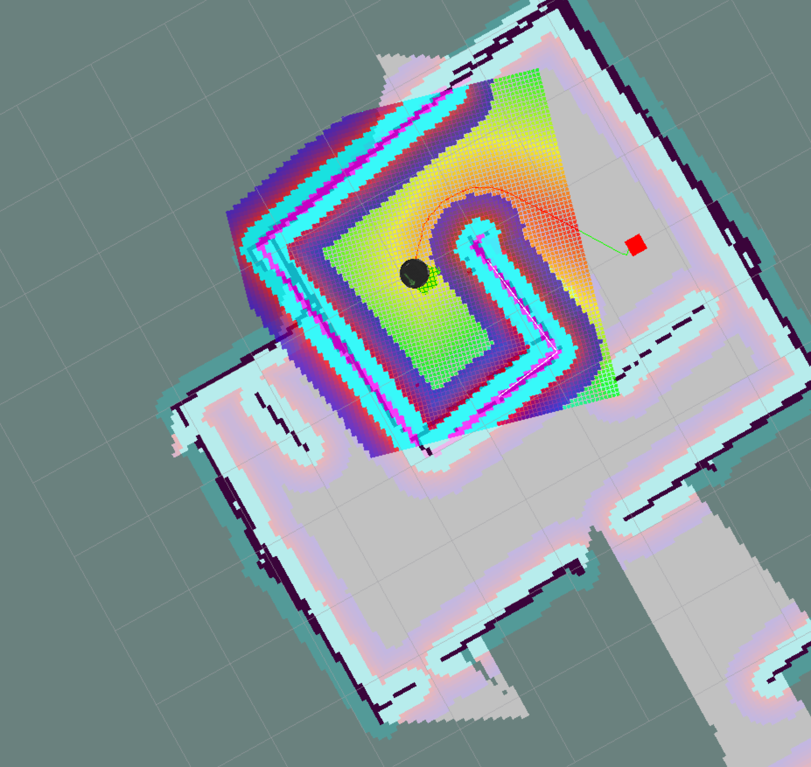

# RoboND_home_service_robot

By: Reza Rahimi

## ROS and Gazebo

The project was developed on Ubuntu 16.04 LTS with ROS Kinetic, Gazebo. 

## Dependencies:

This is a ROS package demonstrating robot localisation, using AMCL. This is a one of the Udacity project assignment that is part of the Robotics Software Engineer Nanodegree program.  

The ROS project is utilising the following main nodes and packages: 

- Udacity pgm_map_creator: Creates pgm maps from Gazebo world files. The map is used for ROS localisation. Github link: https://github.com/udacity/pgm_map_creator

- ROS Navigation package can be downloaded from git: https://github.com/ros-planning/navigation
  The following nodes that are part of the navigation package are used: 
  
  1. amcl: Used for localisation of the Robot. More info: http://wiki.ros.org/amcl
  2. map_server: Offers map data as a ROS service. More ifo: http://wiki.ros.org/map_server
  3. move_base: Used to define a navigation goal position for the robot for testing. More info: http://wiki.ros.org/move_base
  

## Launch:

  

